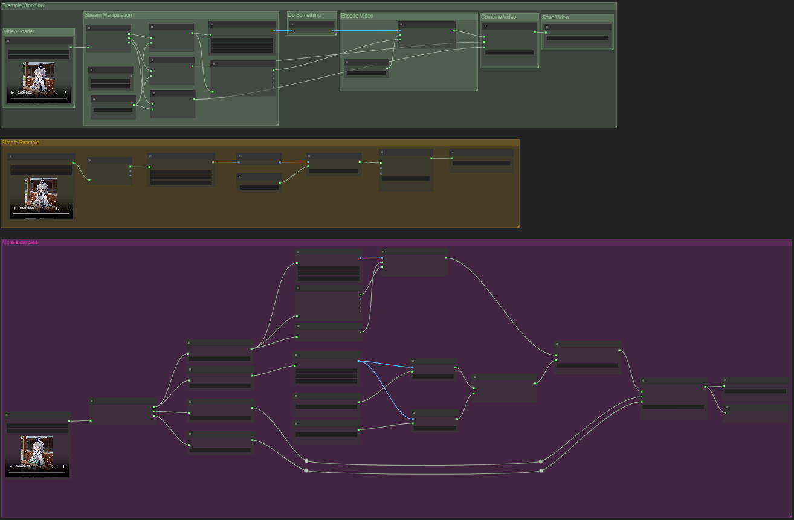
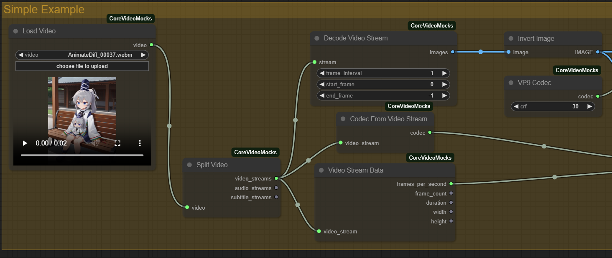
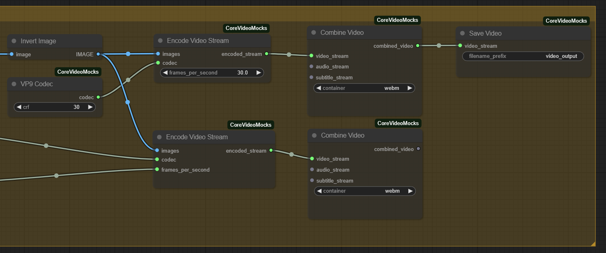

# ComfyUI Core Video Nodes
A mock of a possible implementation of for ComfyUI Core Video Nodes. 

# Example
This example incorporates nodes from [ComfyUIGenericBatchMockNodes](https://github.com/Immac/ComfyUIGenericBatchMockNodes). These nodes are used because video containers can contain multiple streams of the same type. However, the primary purpose of these nodes does not depend on using batch nodes to achieve functionality.

[workflow](<Mock Video Workflows.json>)

